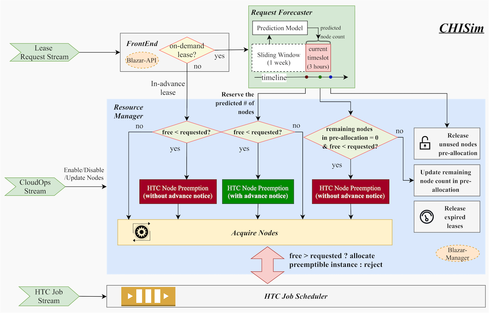

# CHISim

## Repository for SC2021 ACM Student Research Competition.

[Poster & Summary](https://sc21.supercomputing.org/proceedings/src_poster/src_poster_pages/spostg104.html)

CHISim is a data-driven simulator developed for evaluating the strategies of co-locating Chameleon Cloud with High Throughput Computing(HTC) workloads. CHISim replicates the components and processing logic of the OpenStack Blazar, the Chameleon resource manager. 

## Learn More

[Chameleon Trovi Artifact](https://www.chameleoncloud.org/experiment/share/56)

[Youtube](https://www.youtube.com/watch?v=LMIF1M-hiyE)
