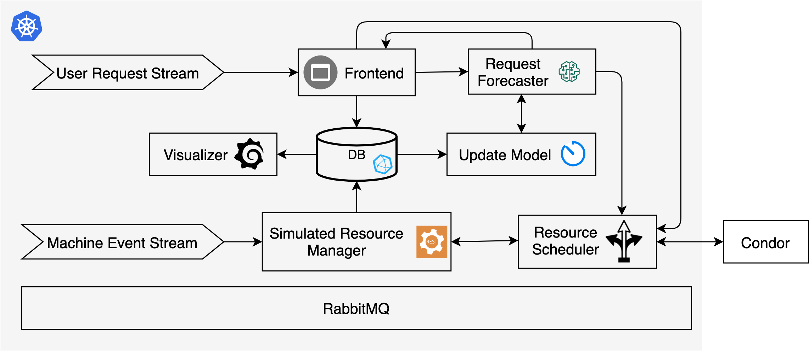

# Chameleon Cloud Simulator

## System Architecture

This framework will be deployed in a Kubernetes cluster on the Chameleon Cloud. All components will be run as containers.

## Components Description

### On-demand Request Stream

An application that reads lease requests from the [TACC-Log](../datasets/lease_info_tacc.csv) and [UC-Log](../datasets/lease_info_uc.csv) files, then sends to the Frontend Platform Service.  The pub application scales down the interval between sends to reduce simulation time and ensures the workload pattern remains the same.

Sample feature:
- lease_id
- project_id
- user_id
- created_at: when the lease is created by the user
- deleted_at: when the lease is deleted by the user (user may delete the lease before the scheduled lease expiration time)
- start_on: when the lease starts
- end_on: when the lease ends (user may delete the lease before this time)
- status: the final status of the lease (don’t trust this column. It may say “active”, but the lease is already terminated)
- node_cnt: the number of nodes we give to the user
- reserve_condition: what kind of nodes the user is asking for
- reserve_count_range: the number of nodes the user is asking for (min-max)

### Frontend

- The Frontend component receives input on-demand request stream, performs data preprocessing, and writes samples into database.
- It maintains a certain number of samples in a sliding window, used as input of the Request Forecaster.
- It holds returned prediction results locally until the actual request happens. If the actual request is larger than the predicted one, the Frontend notifies the Resource Scheduler to adjust the scheduling decision.
- If a request is an in-advance request or scale-in/out request, the Frontend service directly notify the Resource Scheduler.

### Request Forecaster

A pre-trained LSTM model that predicts succeeding on-demand user requests based on a certain number of preceding records. This model is associated with an updater that periodically retrains the model based on new data.

### Machine Event Stream

Given Chameleon operator may CREATE/UPDATE/ENABLE/DISABLE machines sometimes, we use the [Machine Event Trace](../datasets/tacc_machine_events.csv) dataset to simulate available nodes in the resource pool.

Sample Features:

- EVENT_TIME: the timestamp when the event occured
- EVENT_TIME_SEC: duration in seconds
- HOST_NAME (PHYSICAL): Masked host name (primary key)
- EVENT: CREATE/UPDATE/ENABLE/DISABLE
- PROPERTIES: meta information of the machine

### Simulated Resource Manager

- Preprocess input event stream and updates the snapshoot of resource pool in database.
- It exposes a REST interface that allows the Resource Scheulder to get resource utilization information and update resource availability.

### Resource Scheduler

Produce baremetal deployment and preemption decisions based on available resources, user requests and information get from the HTCondor Server.

More details: TBD

### DB

A InfluxDB database that stores user-request and Chameleon resource usage samples.

### RabbitMQ

The databus for supporting communication between components in the framework.

### Condor

HTCondor server that allows us to get OSG jobs execution information for making instance deployment and termination decisions.

 